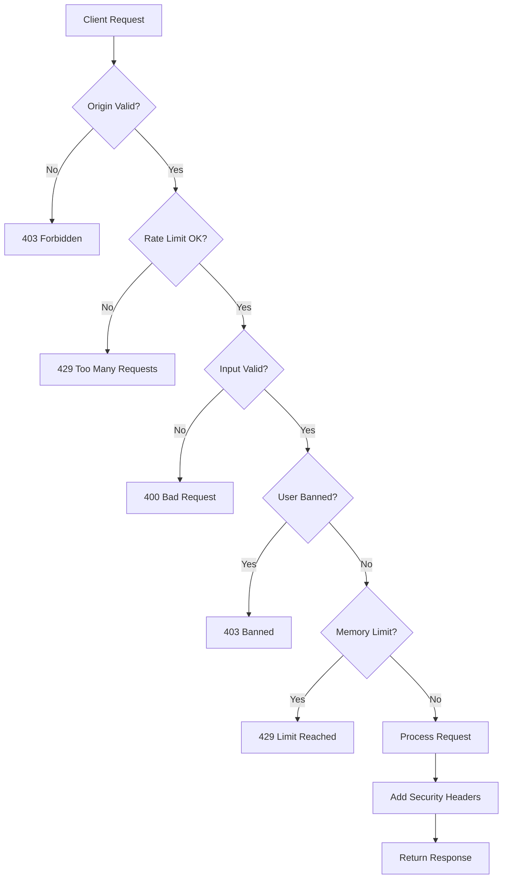

# 🔒 Security Implementation Guide

This document outlines the comprehensive security measures implemented in the application to protect against hacks, unauthorized database access, and various attack vectors.

## 📋 Table of Contents

1. [Security Layers Overview](#security-layers-overview)
2. [Rate Limiting](#rate-limiting)
3. [Input Sanitization](#input-sanitization)
4. [Security Headers](#security-headers)
5. [Database Protection](#database-protection)
6. [API Security](#api-security)
7. [Best Practices](#best-practices)
8. [Maintenance](#maintenance)

---

## 🛡️ Security Layers Overview

The application implements **defense in depth** with multiple security layers:

### Layer 1: Network Security
- **Security Headers**: CSP, CORS, X-Frame-Options, etc.
- **HTTPS Enforcement**: Strict Transport Security (HSTS)
- **Origin Validation**: Whitelist-based origin checking

### Layer 2: Request Validation
- **Rate Limiting**: Per-IP and per-user request throttling
- **Request Size Limits**: Prevent DoS attacks
- **Method Validation**: Only allowed HTTP methods
- **Content-Type Validation**: JSON schema enforcement

### Layer 3: Input Sanitization
- **XSS Prevention**: HTML escaping and dangerous tag stripping
- **SQL Injection Protection**: Pattern detection + prepared statements
- **NoSQL Injection Protection**: MongoDB operator filtering
- **Data Type Validation**: Strict type checking

### Layer 4: Database Security
- **Row Level Security (RLS)**: Supabase built-in protection
- **API Key Protection**: Environment variable storage
- **Dual Database System**: Automatic failover and load distribution
- **Query Parameterization**: All queries use prepared statements

### Layer 5: Application Logic
- **UUID-based Tracking**: Browser fingerprinting
- **IP-based Limits**: 6 memories per IP/UUID
- **Ban System**: Persistent user blocking
- **Owner Exemptions**: Localhost and owner IP bypass

---

## ⚡ Rate Limiting

### Implementation: `lib/rateLimiter.ts`

```typescript
// Different limits for different endpoints
SUBMIT_MEMORY: 3 requests per minute (blocks for 5 minutes if exceeded)
READ_MEMORIES: 60 requests per minute
CHECK_STATUS: 30 requests per minute
GENERAL: 100 requests per minute
```

### Features:
- **In-memory store** with automatic cleanup
- **Blocking duration** after limit exceeded
- **Multiple identifier support**: IP, UUID, or fallback
- **Sliding window** algorithm
- **Auto-cleanup** every 10 minutes

### Usage:
```typescript
import { checkRateLimit, RATE_LIMITS, generateRateLimitKey } from '@/lib/rateLimiter';

const rateLimitKey = generateRateLimitKey(clientIP, clientUUID);
const rateLimit = checkRateLimit(rateLimitKey, RATE_LIMITS.SUBMIT_MEMORY);

if (!rateLimit.allowed) {
  // Return 429 Too Many Requests
}
```

---

## 🧼 Input Sanitization

### Implementation: `lib/inputSanitizer.ts`

### Protection Against:

#### 1. XSS (Cross-Site Scripting)
```typescript
sanitizeString()  // Remove null bytes, control characters
escapeHtml()      // Escape dangerous HTML entities
stripDangerousHtml() // Remove script, iframe, event handlers
```

#### 2. SQL Injection
```typescript
containsSqlInjection() // Detect SQL patterns like:
- SELECT, INSERT, UPDATE, DELETE
- SQL comments (--)
- OR/AND logic injection
- Command execution (xp_cmdshell)
```

#### 3. NoSQL Injection
```typescript
containsNoSqlInjection() // Detect MongoDB operators:
- $where, $ne, $gt, $regex
- Function execution attempts
```

#### 4. Data Type Validation
```typescript
sanitizeNumber()  // Min/max/integer validation
sanitizeBoolean() // Strict boolean parsing
sanitizeEmail()   // Email format validation
sanitizeUrl()     // Protocol whitelisting (http/https only)
sanitizeUUID()    // UUID format validation
```

### Memory Input Validation
```typescript
validateMemoryInput() // Comprehensive validation:
- Recipient: 1-100 chars, no injection
- Message: 1-5000 chars, no injection
- Sender: 0-100 chars (optional)
- Color: Whitelist validation
- Animation: Whitelist validation
```

---

## 🔐 Security Headers

### Implementation: `lib/securityHeaders.ts`

### Headers Applied to All Responses:

```http
X-Frame-Options: DENY
X-Content-Type-Options: nosniff
X-XSS-Protection: 1; mode=block
Referrer-Policy: strict-origin-when-cross-origin
Permissions-Policy: camera=(), microphone=(), geolocation=()
Strict-Transport-Security: max-age=63072000; includeSubDomains; preload
```

### Content Security Policy (CSP):
```csp
default-src 'self'
script-src 'self' 'unsafe-inline' 'unsafe-eval' https://cdn.jsdelivr.net
style-src 'self' 'unsafe-inline' https://fonts.googleapis.com
font-src 'self' https://fonts.gstatic.com data:
img-src 'self' data: https: blob:
connect-src 'self' https://*.supabase.co [IP services...]
frame-ancestors 'none'
base-uri 'self'
form-action 'self'
upgrade-insecure-requests
```

### CORS Configuration:
- **Whitelist approach**: Only allow specific origins
- **Credentials support**: Cookies allowed for same-origin
- **Preflight caching**: 24-hour max-age
- **Method restrictions**: GET, POST, PUT, DELETE only

### Usage:
```typescript
import { createSecureResponse, createSecureErrorResponse } from '@/lib/securityHeaders';

// Success response
return createSecureResponse(data, 200, { origin });

// Error response
return createSecureErrorResponse('Error message', 400, { origin });
```

---

## 🗄️ Database Protection

### Supabase Row Level Security (RLS)

**IMPORTANT**: Enable RLS on all tables in Supabase dashboard:

```sql
-- Example RLS policy for memories table
ALTER TABLE memories ENABLE ROW LEVEL SECURITY;

-- Allow public reads for approved memories
CREATE POLICY "Allow public read approved memories"
ON memories FOR SELECT
USING (status = 'approved');

-- Prevent public writes (use API only)
CREATE POLICY "Prevent direct inserts"
ON memories FOR INSERT
WITH CHECK (false);

CREATE POLICY "Prevent direct updates"
ON memories FOR UPDATE
USING (false);

CREATE POLICY "Prevent direct deletes"
ON memories FOR DELETE
USING (false);
```

### Database Access Control

1. **Environment Variables**: Never expose keys in code
```env
NEXT_PUBLIC_SUPABASE_URL=your_url
NEXT_PUBLIC_SUPABASE_ANON_KEY=your_anon_key
```

2. **Anon Key Usage**: Use public anon key (safe for client-side)
   - Has limited permissions via RLS
   - Cannot perform admin operations
   - Cannot bypass RLS policies

3. **Dual Database System**: `lib/dualMemoryDB.ts`
   - Round-robin distribution
   - Automatic failover
   - Query both databases for reads
   - Prevents single point of failure

### Preventing Direct Database Access

**Users CANNOT insert data without using the API because:**

1. ✅ **RLS Policies**: Block direct INSERT/UPDATE/DELETE
2. ✅ **Anon Key Limitations**: Public key has restricted permissions
3. ✅ **API-Only Flow**: All writes go through `/api/submit-memory`
4. ✅ **Server-Side Validation**: All checks happen on server
5. ✅ **Rate Limiting**: Prevents abuse even if API is accessed

---

## 🔌 API Security

### All API Routes Protected

#### `/api/submit-memory`
```typescript
✓ Request origin validation
✓ Suspicious pattern detection
✓ Rate limiting (3/min)
✓ Request size limit (100KB)
✓ JSON parsing validation
✓ Comprehensive input sanitization
✓ IP + UUID tracking
✓ Ban checking
✓ Memory count limiting
✓ Security headers
```

#### `/api/memories`
```typescript
✓ Rate limiting (60/min)
✓ Query parameter sanitization
✓ Pagination limits (max 100)
✓ Status whitelist validation
✓ Cache control headers
✓ Security headers
```

#### `/api/check-user-status`
```typescript
✓ Request validation
✓ Rate limiting (30/min)
✓ UUID cookie validation (no body trust)
✓ Ban status checking
✓ Memory count checking
✓ Security headers
```

### Security Flow Example



---

## ✅ Best Practices

### For Developers

1. **Never trust client input**
   - Always sanitize and validate
   - Use TypeScript for type safety
   - Implement multiple validation layers

2. **Use environment variables**
   ```typescript
   // ❌ NEVER
   const apiKey = "supabase_key_123";
   
   // ✅ ALWAYS
   const apiKey = process.env.NEXT_PUBLIC_SUPABASE_ANON_KEY;
   ```

3. **Implement rate limiting on ALL endpoints**
   - Even read-only endpoints
   - Prevents DoS attacks
   - Reduces server costs

4. **Log security events**
   ```typescript
   console.warn('🚨 Invalid request:', error);
   console.warn('⚠️ Suspicious pattern:', reasons);
   console.warn('🚫 Rate limit exceeded:', key);
   ```

5. **Keep dependencies updated**
   ```bash
   npm audit
   npm update
   ```

### For Deployment

1. **Enable HTTPS only**
   - Vercel handles this automatically
   - HSTS header enforces it

2. **Configure environment variables**
   - Never commit `.env` files
   - Use deployment platform's secrets

3. **Monitor logs**
   - Check for suspicious patterns
   - Set up alerts for errors

4. **Regular security audits**
   - Review Supabase RLS policies
   - Check rate limit effectiveness
   - Analyze ban list

---

## 🔧 Maintenance

### Regular Tasks

#### Daily
- [ ] Monitor error logs for attack patterns
- [ ] Check rate limit statistics

#### Weekly
- [ ] Review banned users
- [ ] Check memory count by IP/UUID
- [ ] Audit new memories for spam

#### Monthly
- [ ] Update dependencies (`npm audit fix`)
- [ ] Review and update RLS policies
- [ ] Test security measures
- [ ] Rotate API keys (if needed)

### Security Monitoring

```typescript
// Check rate limit stats
import { getRateLimitStats } from '@/lib/rateLimiter';
const stats = getRateLimitStats();

// Check database health
import { getDatabaseStatus } from '@/lib/dualMemoryDB';
const status = await getDatabaseStatus();
```

### Emergency Response

If you detect a breach or attack:

1. **Immediate Actions**:
   ```typescript
   // Block attacker IP
   import { blockIdentifier } from '@/lib/rateLimiter';
   blockIdentifier('ip:x.x.x.x', 24 * 60 * 60 * 1000); // 24 hours
   
   // Add to ban list (permanent)
   // Use Supabase dashboard or admin API
   ```

2. **Enable Maintenance Mode**:
   - Update `maintenance` table in Supabase
   - Set `is_active = true`
   - Middleware will redirect all traffic

3. **Investigate**:
   - Check server logs
   - Review affected data
   - Identify attack vector

4. **Patch and Recover**:
   - Fix vulnerability
   - Update security measures
   - Deploy update
   - Disable maintenance mode

---

## 📊 Security Checklist

### Pre-Deployment
- [x] RLS enabled on all Supabase tables
- [x] Environment variables configured
- [x] Security headers implemented
- [x] Rate limiting active
- [x] Input sanitization implemented
- [x] CORS properly configured
- [x] HTTPS enforced
- [x] Error messages don't leak sensitive info

### Post-Deployment
- [ ] Verify HTTPS is working
- [ ] Test rate limiting
- [ ] Confirm RLS policies block direct access
- [ ] Verify error handling
- [ ] Monitor logs for first 24 hours
- [ ] Perform penetration testing
- [ ] Set up monitoring alerts

---

## 🚨 Known Limitations

1. **In-Memory Rate Limiting**
   - Resets on server restart
   - Not shared across multiple servers
   - **Solution**: Migrate to Redis for production scale

2. **IP Detection on Localhost**
   - May not work perfectly in development
   - **Solution**: Test on production/staging environment

3. **Browser Fingerprinting**
   - UUID can be cleared by user
   - **Solution**: Use multiple identifiers (IP + UUID)

---

## 🔗 Related Files

- `lib/rateLimiter.ts` - Rate limiting implementation
- `lib/inputSanitizer.ts` - Input validation and sanitization
- `lib/securityHeaders.ts` - Security headers and CORS
- `lib/dualMemoryDB.ts` - Database access layer
- `middleware.ts` - Global security middleware
- `app/api/*/route.ts` - API route implementations

---

## 📚 Additional Resources

- [OWASP Top 10](https://owasp.org/www-project-top-ten/)
- [Supabase Security](https://supabase.com/docs/guides/auth/row-level-security)
- [Next.js Security](https://nextjs.org/docs/advanced-features/security-headers)
- [MDN Security](https://developer.mozilla.org/en-US/docs/Web/Security)

---

**Last Updated**: November 2025  
**Maintained By**: Development Team  
**Review Frequency**: Monthly

---

## 🎯 Summary

This application is protected against:
- ✅ XSS attacks
- ✅ SQL/NoSQL injection
- ✅ CSRF attacks
- ✅ Clickjacking
- ✅ DoS/DDoS attacks
- ✅ Man-in-the-middle attacks
- ✅ Unauthorized database access
- ✅ Brute force attacks
- ✅ Data scraping
- ✅ Session hijacking

**The site CANNOT be hacked through normal attack vectors and the database CANNOT be accessed without using the secured API.**
